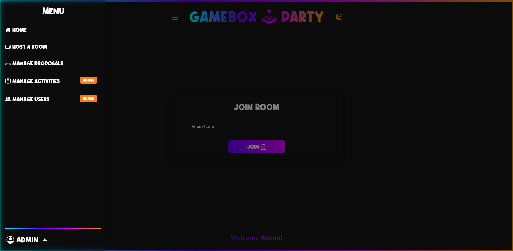
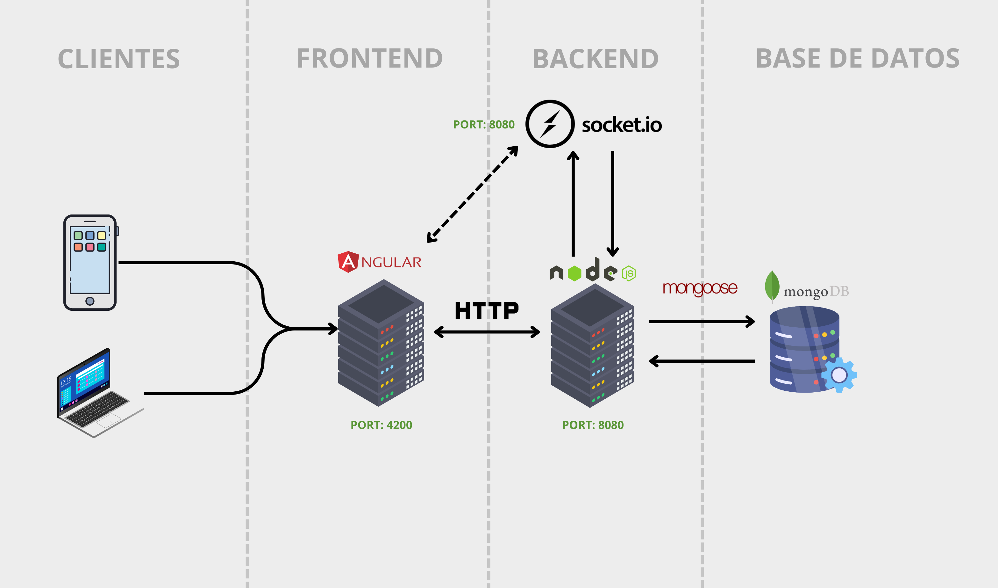

# GameBox Party

GameBox Party is a platform that allows users to create rooms and enjoy interactive activities with friends. The main feature of the site is the creation of rooms where participants vote for activities provided by users.

## Table of Contents

- [Architecture Diagram](#architecture-diagram)
- [Installation](#installation)
- [Configuration](#configuration)
- [Usage](#usage)
- [Features](#features)
- [Project Structure](#project-structure)

## Architecture Diagram

## Installation
**1. Clone the repository.**

### Frontend (Angular)
1. In the `/angular-project` folder, run `npm i` to install dependencies.

### Backend (Node.js and Express)
1. In the `/api-gameboxparty` folder, run `npm i` to install dependencies.
2. Set up a `.env` file with the necessary information for the API.

## Configuration

### Frontend (Angular)
- To change the API route in development, modify `src/environments/environment.development.ts`.
- To change the API route in production, modify `src/environments/environment.ts`.

### Backend (Node.js and Express)
- Create and configure the `.env` file in the `/api-gameboxparty` folder with the following parameters:
  - **API_HOST**= _API host, e.g., "localhost"_
  - **API_PORT**= _API port, e.g., "8080"_
  - **CORS_ORIGIN**= _Frontend web address, e.g., "http://localhost:4200"_
  - **MONGO_URL**= _Mongo database URL. Local or Atlas_
  - **JWT_SECRET**= _A secret for token signing and decoding_

## Usage

### Development Environment (Angular)
- Run `npm start` or `ng serve` to start the development server.

### Production (Angular)
- For build: `ng build`.
- To run in production:
  - Install the http-server package globally: `npm i -g http-server`.
  - Navigate to the build folder (`dist/angular-project`).
  - Run the command `http-server`.

### Development Environment (Backend)
- Run `npm run dev` to start in development mode.

### Production (Backend)
- For build: `npm build`.
- To run: `npm start`.

## Features

### Normal User
- Creates rooms and proposals.
- Edits their profile and deletes the account if necessary.

### Guest
- Can access and play in rooms created by registered users through a room code.

### Administrator
- Normal user functionalities.
- Manages users and activities.

## Project Structure

- Frontend Folder: `/angular-project`.
- Backend Folder: `/api-gameboxparty`.
